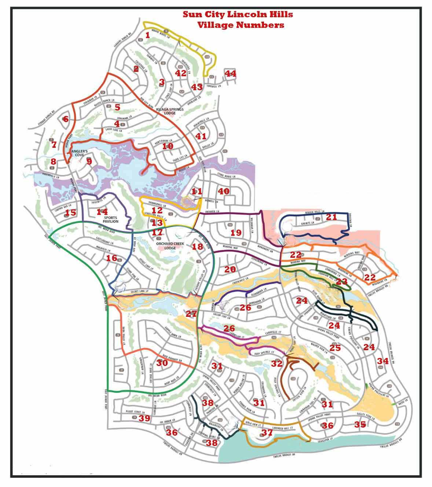

```{r setup, include=FALSE}
knitr::opts_chunk$set(echo = TRUE)
```

```{r libraries packages, include=FALSE, echo=FALSE, message=FALSE}
if(!require(corrr)) install.packages("corrr", repos = "http://cran.us.r-project.org")
if(!require(corrplot)) install.packages("corrplot", repos = "http://cran.us.r-project.org")
if(!require(dslabs)) install.packages("dslabs", repos = "http://cran.us.r-project.org")
if(!require(funModeling)) install.packages("funModeling", repos = "http://cran.us.r-project.org")
if(!require(GGally)) install.packages("GGally", repos = "http://cran.us.r-project.org")
if(!require(gclus)) install.packages("gclus", repos = "http://cran.us.r-project.org")
if(!require(ggplot2)) install.packages("ggplot2", repos = "http://cran.us.r-project.org")
if(!require(ggthemes)) install.packages("ggthemes", repos = "http://cran.us.r-project.org")
if(!require(imager)) install.packages("imager", repos = "http://cran.us.r-project.org")
if(!require(kableExtra)) install.packages("kableExtra", repos = "http://cran.us.r-project.org")
if(!require(lemon)) install.packages("lemon", repos = "http://cran.us.r-project.org")
if(!require(skimr)) install.packages("skimr", repos = "http://cran.us.r-project.org")
if(!require(themis)) install.packages("themis", repos = "http://cran.us.r-project.org")
if(!require(tidymodels)) install.packages("tidymodels", repos = "http://cran.us.r-project.org")
if(!require(tidyverse)) install.packages("tidyverse", repos = "http://cran.us.r-project.org")
if(!require(vip)) install.packages("vip", repos = "http://cran.us.r-project.org")
if(!require(viridis)) install.packages("viridis", repos = "http://cran.us.r-project.org")
if(!require(visdat)) install.packages("visdat", repos = "http://cran.us.r-project.org")
```
```{r environment, include=FALSE}
knitr::opts_chunk$set(echo = TRUE)
# lemon functions
knit_print.data.frame <- lemon_print
# adjust plot margins
graphics.off()
par("mar")
par(mar=c(1,1,1,1))
options(max.print = 10000)        # Change global options
# Rounding numbers
options(digits = 2)              
```

```{r github, echo=FALSE, message=FALSE}
# Read in dataset
sun <- read.csv("SunCity.csv", stringsAsFactors = TRUE)
# convert int to numeric
sun[8:11] <- lapply(sun[8:11], as.numeric)
```
This report is available on Github at: [HarvardX-PH125.9X/Holeman_Capstone_2.pdf](HarvardX-PH125.9X/Holeman_Capstone_2.pdf)


# Introduction

The general goal of machine learning in prediction is to build models out of the patterns in data to use for making future predictions. To that end, this project concerns the construction of a project-oriented dataset and the building of two such machine learning models relaated to criterion of interest to homebuyers and sellers.


Chosen as the data source for this project are the homes in the 3,000 acres community of Sun City Lincoln Hills in California's Sierra foothills. It is an adult homeowner retirement community of some 11,000 residents with a median age of 74, of which 43% are males, and 57% are female. They are essentially empty nesters who live in 6,703 houses and 80 condominiums. Families occupy no homes with children. Couples reside in 58% of the homes, single-females occupy 34%, and single-males 8%.


Sun City itself is a walled-in community. The residents enjoy dining, entertainment, and a wide range of recreational facilities, including bocce ball, softball, tennis, Wiffle ball, indoor/outdoor swimming pools, parks, and golf courses. Sun City is within the census area of the City of Lincoln, which is ranked nationally as a safe city. Violent crime rank is 14.6 compared to the US average of 22.7. Property crime rank is 19.9; the US average is 35.4.


Homebuilding in Sun City occurred between 1999 and 2008. The homes range from 900 sq ft cottages to 11,000 sq ft estates. Since its construction, Sun City has experienced a steady turnover in
homeownership and rising home values. Accordingly, the project deals in home selection and sale price, key issues to homebuyers and sellers.

\pagebreak

# Methods and Analysis

Two supervised machine learning models are built:

- Decision Tree classification model to predict the home type based on the other feature variables.
- KNN regression model to predict home selling price based on dataset features.

The methodology for doing so involves five stages.

1. Use of a personally webscraped dataset that is exclusive to the project. This decision is in keeping with instructional guidance to avoid using well-known datasets, particularly ones that have been used as examples in previous courses or are similar to them. Accordingly, the project dataset is constructed from public real estate sources on the web of homes sold in Sun City Lincoln Hills California during the years 2019 through 2021 and recorded by the Placer County assessor.

2. Exploratory data analysis (EDA) to provide a high-level understanding of home types, home sale prices, home quality ratings, and home attributes, such as lot size, living area, bedrooms, and bathrooms.

3. Supervised machine learning modeling with R tidymodels, which is more or less a restructuring of the caret framework. It includes these packages:

    *rsample* to split and sample data,

    *recipe* for feature engineering and preprocessing data,

    *parsnip* to select and specify models,

    *workflows* and *tune* to adjust and improve model processing, and

    *yardstick* to evaluate model performance.


4. Performance results of the Decision Tree and KNN models' predictions.


5. Project summary of the models' utility and their potential for predicting future home selection and sale price in Sun City.

\pagebreak

# The Sun City dataset.

The project dataset contains features of the 935 homes sold in Sun City Lincoln Hills from 2019 through 2021. Each column entry is a feature, and each row represents a home sold.


```{r dataset, echo=FALSE, message=FALSE}
vis_dat(sun)
```

\pagebreak

In this overview of dataset features are the categorical and numerical variables in the data. Correlation coefficients are Pearson by default. 
 

```{r data overview, echo=FALSE, message=FALSE}
sun %>% 
  select(
    sale_price,
    sqft_living, 
    sqft_garage,
    home_type) %>% 
  ggpairs()
```

\pagebreak

# Exploratory Data Analysis (EDA).

EDA begins with a glimpse of the dataset, and a missing data check.

```{r render=lemon_print}
### Dataset glimpse
glimpse(sun)
```

```{r echo=FALSE, message=FALSE}
# Missing values check
is.na(sun) %>% colSums()
```


\pagebreak


All homes were built over a ten-year timeframe and included condos, cottages, and houses. Classic, Premier, and Estate refer to house types.

```{r  echo=FALSE, message=FALSE}
# Distribution by year built
yr_table <- table(sun$home_type, sun$year_built)
yr_table %>% 
  kable(format='markdown')
```
Home floor plans define a home type. While condos and cottages have two floor plans, houses have over forty. The Classic house-type floor plans are the base size in square feet, and Premier house types include more extensive floor plans and higher sales prices. Estate house types have upscale floor plans, the costliest and often the largest.

These are the names of house floor plans.

Classic house floor plans.
```{r echo=FALSE, message=FALSE}
classic <- sun %>% 
  filter(home_type == "Classic")
classicModels <- unique(classic$floorplan)
print(sort(classicModels)) 
```

Premier house floor plans.
```{r echo=FALSE, message=FALSE}
premier <- sun %>% 
  filter(home_type == "Premier")
premierModels <- unique(premier$floorplan)
print(sort(premierModels))
```

Estate house floor plans.
```{r echo=FALSE, message=FALSE}
estate <- sun %>% 
  filter(home_type == "Estate")
estateModels <- unique(estate$floorplan)
print(sort(estateModels))
```
\pagebreak

This bar chart shows the distribution of home sales (condo, cottage, and house) in 2019 through 2021 by floor plan. The Classic house accounts for most home sales.

```{r echo=FALSE,message=FALSE}

sun %>% 
ggplot()+
geom_bar(aes(x = floorplan),fill="grey",color="black") +
coord_flip()+
scale_x_discrete(limits = rev)+  # reverse floorplan alphabetically
theme_classic()  
```
\pagebreak

This histogram is of home sales by type.

```{r echo=FALSE}
# geom_bar to show home count 
g <- ggplot(sun, aes(home_type), fill=home_type)
# number of homes in each type:
g + geom_bar(aes(fill = home_type))+
labs(title = "Sales by Home Type 2019 through 2021",
          subtitle = "Sun City Lincoln Hills",
          x="Home Type", y="Count by Type ") +
  theme_classic()
```

\pagebreak

The median home sale price in 2019 through 2021 is $564,000, with the least expensive at $244,000 and the most expensive at $1,205,000. Note the outliers in the sale price of Estate and Classic houses.


```{r echo=FALSE,message=FALSE}
# boxplot median sale price
data <- sun %>% 
  select(home_type,sale_price) 
# Plot 
data %>%
  ggplot( aes(x=home_type, y=sale_price, fill=home_type)) +
  geom_boxplot() +
  scale_fill_viridis(discrete = TRUE, alpha=0.6) +
  scale_y_continuous(labels = dollar_format()) +
  theme_classic() +
  theme(legend.position="none", plot.title = element_text(size=11)) +
  labs(title = "Median Sale Price of Homes 2019 through 2021",
       subtitle = "By Home Type in Sun City Lincoln Hills",
       x = "Home Type", y = "Sale Price") 
```

This tabulation is of home sales by home type in 2019 through 2021.

```{r echo=FALSE, message=FALSE}
# all homes sold in 2021 by count
print(table(sun$home_type)) 
```

These are the proportions of total homes sales by type in 2019 through 2021.


```{r echo=FALSE, message=FALSE}
proportions(table(sun$home_type))*100
```

\pagebreak

## Model refinement: home type(s) selected for modeling. 

Homes not selected include condos as they are essentially an apartment and cottages as they number less than a handful. Limiting data dimensions also improves modeling accuracy.


```{r echo=FALSE, message=FALSE}
# Select dataset house types
houses <- sun %>% 
  filter(home_type!="Condo" & home_type!="Cottage")
```

```{r include=FALSE}
# Drop unused home_type levels
houses <- droplevels(houses)
str(houses)
```

Houses are the home type chosen for modeling and decisions made on which features to include in the process.


```{r echo=FALSE, message=FALSE}
# Modeling house types 
print(table(houses$home_type)) 
```

```{r echo=FALSE, message=FALSE}
# Sales price by house model.
houses %>% 
  # filter(!is.na(home_type)) %>% 
  ggplot(aes(y=sale_price, x=sqft_living, color = home_type, size = sale_price)) +
  scale_y_continuous(labels = dollar_format()) +
  geom_point(alpha = 0.5) +
  facet_wrap(~home_type)+
  labs(y="Sale Price in thousands USD", x="Sqft Living Space")
```

\pagebreak

## Features not selected for modeling.

* Review house sales by village.


```{r echo=FALSE, message=FALSE}
houses_table <- table(houses$village,houses$home_type)
houses_table %>% 
  kable(format='markdown')
```
```{r echo=FALSE, out.width='100%'}

```

\pagebreak

* Village data need not be included in modeling. Village numerical assignment is not germane to modeling as it merely refers to construction schedules. Neither relevant to modeling is a comparison of sales volume by the village as villages range in size from a hamlet to a large block of houses. Nor is village milieu relevant because little distinguishes one village from another. Stringent HOA rules dictate uniformity in house exteriors and landscaping.

* Other features not included for modeling: the number of house floor levels, bedrooms, and bathrooms. Virtually all houses are single story and have two bathrooms and two bedrooms. With very few exceptions, Estate models may have more than two bedrooms.


## Features selected for modeling. 

The dataset features for this project's modeling are limited to the sale price, house model, year built, and the square footage of living, bedroom, and garage spaces. A point is made in modeling literature that smaller datasets are easier to explore, visualize, and analyze.

```{r echo=FALSE, message=FALSE}
# Features selected for modeling
houses <- houses %>%   
  select(sale_price,sqft_living, sqft_lot, sqft_mbr, sqft_garage, home_type, year_built)
```
```{r echo=FALSE, message=FALSE}
# modeling dataset
names(houses)
```

Features bar chart. 

```{r echo=FALSE, message=FALSE}
freq(houses)
```

Numeric features histograms.

```{r echo=FALSE, message=FALSE }
plot_num(houses)
```
\pagebreak

Numeric features correlation.

Feature color corresponds to the strength of the correlation, and the number is the absolute value of the correlation coefficient for the two features. Noteworthy is the relationship between the sale price and square footage of living and bedroom areas.

```{r corrplot, echo=FALSE,message=FALSE}
dat_num <- houses %>%  
  select(sale_price,sqft_living,sqft_lot,sqft_mbr,
  sqft_garage)
dat_cor <- cor(dat_num)
corrplot(dat_cor, method="number")
```
\pagebreak

Features matrix with data points colored by group and a pairs correlation plot of numeric variables.

 
```{r  include=FALSE,echo=FALSE,message=FALSE}
dat_num <- houses %>%  
  select(sale_price,sqft_living,sqft_lot,sqft_mbr,
  sqft_garage)

```

```{r echo=FALSE, message=FALSE}
# Correlation in absolute terms
corr <- abs(cor(dat_num)) 

colors <- dmat.color(corr)
order <- order.single(corr)

cpairs(dat_num,                 # Data frame of variables
       order,                   # Order of the variables
       panel.colors = colors,   # Matrix of panel colors
       border.color = "grey70", # Borders color
       gap = 0.45,              # Distance between subplots
       main = "Ordered numeric features colored by correlation", # Main title
       show.points = TRUE,      # If FALSE, removes all the points
       pch = 21,                # pch symbol
       bg = rainbow(3)[iris$Species]) # Colors by group
```
\pagebreak

## Feature relationships based on EDA.

Scatter plot of the correlation between house type livable space (square feet) and house sale price. The dataset feature, living space (predictor variable), is on the x-axis, and sale price (response variable) is on the y-axis. Machine learning models provide an exciting way of looking at this feature interrelationship.


```{r price-space correlation, echo=FALSE, message=FALSE}
xy_plot <- ggplot(houses, aes(x = sqft_living, y = sale_price,
                                 color=home_type)
                     ) +
  geom_point() +
  xlab("House living space (square feet)") +
  ylab("Sale Price in thousands USD)") +
  scale_y_continuous(labels = dollar_format()) +
  geom_vline(xintercept = 2000, linetype = "dotted") + 
  theme(text = element_text(size = 12))

xy_plot
```


Given the exploratory analysis of features, continue to modeling with two supervised machine learning models.

 - A Decision Tree classification model to select which dataset feature(s) may be most important in predicting house type.
 - A KNN regression model to predict home selling price based on dataset features.

The tidymodels workflows provide for combining models, but they appear here independently to facilitate model summaries and viewer feedback.

\pagebreak

# The Decision Tree classification model. 

The model goal is to predict the home type based on the other feature variables in the dataset. 

Modeling begins with the rsample package initial-split function to specify instructions for creating training and testing sets and sets the stratification outcome to house_type for a good representation in the testing and training data..

```{r echo=FALSE, message=FALSE}
# set seed so results can be later reproduced.
set.seed(123)
split_houses <- initial_split(houses, strata = home_type, prop = .80)
```

The training set.


```{r echo=FALSE, message=FALSE}
# create training set 
training_houses <-training(split_houses)
head(training_houses)
```

Training set count:


```{r echo=FALSE, message=FALSE}
# Count training set 
count(training_houses, home_type)
```

The testing set estimates how the trained model will perform on new data. It also guards against overfitting, where a model memorizes patterns that exist only in the training data and performs poorly on new data.
```{r echo=FALSE, message=FALSE}
# Create testing set
testing_houses <-testing(split_houses)
head(testing_houses)
```

Testing set count:

```{r echo=FALSE, message=FALSE}
# Testing set count.
count(testing_houses, home_type)
```

Holdout created with the rsample package to deal with hyperparameter aspects about the model that cannot be learned directly during the training process but need to be specified. * rsample package https://rsample.tidymodels.org/reference/vfold_cv.htm


```{r echo=FALSE, message=FALSE}
set.seed(1234)
vfold_houses <- rsample::vfold_cv(data = training_houses, v = 4)
vfold_houses
```

Four data folds are set aside for testing within each fold. The holdout method conducts iterations of the training data, divided into equally sized four folds for training and leaving one fold out for use as a test set. 
```{r echo=FALSE, message=FALSE}
pull(vfold_houses, splits)
```
Get better sense of the out-of-sample performance of the model using the training data.
Cross-validation samples using v-fold cross-validation. (i.e., k-folds Chap 29, Irizarry text.)

```{r echo=FALSE, message=FALSE}
# training set of this fold
first_fold <-vfold_houses$splits[[1]]
head(as.data.frame(first_fold, data = "analysis")) 
```
```{r echo=FALSE, message=FALSE}
# test set of this fold
head(as.data.frame(first_fold, data = "assessment")) 
```
Create another recipe model and workflow

```{r echo=FALSE, message=FALSE}
cat_recipe <- training_houses %>%
recipe(home_type ~ .)
```

Specify the model for classification with parsnip and the rpart package as the engine to tune. (parsnip package. https://www.tmwr.org/tuning.html)


```{r echo=FALSE, message=FALSE}
cat_model <- parsnip::decision_tree() %>%
             parsnip::set_mode("classification") %>%
             parsnip::set_engine("rpart")
cat_model
```

Make workflow

```{r echo=FALSE, message=FALSE}

houses_cat_wflow <-workflows::workflow() %>%
           workflows::add_recipe(cat_recipe) %>%
           workflows::add_model(cat_model)
houses_cat_wflow
```

Model fit and tuned with the training data cross-validation subsets. 

Model performance is evaluated with cross-validation using tune and the complete training dataset. 


```{r echo=FALSE, message=FALSE}
houses_cat_wflow_fit <- parsnip::fit(houses_cat_wflow, data = training_houses) 
houses_cat_wflow_fit
```

```{r echo=FALSE, message=FALSE}
wf_fit_cat <- houses_cat_wflow_fit %>% 
  pull_workflow_fit()
  # extract_fit_parsnip()
```
Feature importance. wf_fit output describes which features are relevant for classifying the data values. Each feature score shows a decrease in error when splitting each feature relative to others.

```{r echo=FALSE, message=FALSE}
wf_fit_cat$fit$variable.importance
```
Square footage living space (.988) is the most relevant feature for predicting home type, and it is consistent with the EDA correlation charts.

The predict function returns the predicted values.

```{r echo=FALSE, message=FALSE}
pred_home_type<-predict(houses_cat_wflow_fit, new_data = training_houses)

# yardstick package
accuracy(training_houses, truth = home_type, 
         estimate = pred_home_type$.pred_class)
```

The model correctly predicted the right home type some 99% of the time. 
 
The count function reveals home types correctly predicted.


```{r echo=FALSE, message=FALSE}
count(training_houses, home_type)
```
```{r echo=FALSE, message=FALSE}
count(pred_home_type, .pred_class)
```
Predicted is one extra Estate house model and one Classic model less.  The bind function binds the predicted house type to the training data, revealing the incorrectly predicted values. 

```{r echo=FALSE, message=FALSE}
predicted_and_truth <-bind_cols(training_houses, 
        predicted_home_type = pull(pred_home_type, .pred_class))

head(predicted_and_truth)
```

```{r echo=FALSE, message=FALSE}
# Get the specifications of the workflow and the cross validation fold just created. 
set.seed(123)
resample_fit <- tune::fit_resamples(houses_cat_wflow, vfold_houses)
```
Get performance metrics based on the fit of the cross validation “resamples.”

```{r echo=FALSE, message=FALSE}
resample_fit
```

The accuracy estimate mean of the different cross-validation folds yielded with the tune package collect_metrics function.  (https://tune.tidymodels.org/reference/collect_predictions.html)


```{r echo=FALSE, message=FALSE}
collect_metrics(resample_fit)
```

The takeaway here is that accuracy is now 97%. Reduced performance with cross-validation is not surprising.

The parsnip function specifies hyperparameter tuning with the min_n argument and rpart engine. * parsnip package hyperparameter tuning (https://www.tmwr.org/tuning.html)

```{r echo=FALSE, message=FALSE}
set.seed(122)
library(tune)
cat_model_tune <- parsnip::decision_tree(min_n = tune()) %>%
                  parsnip::set_mode("classification") %>%
                  parsnip::set_engine("rpart") 
cat_model_tune
```

A newly created workflow using the categorical recipe and the tuning model:

```{r echo=FALSE, message=FALSE}
houses_cat_wflow_tune <-workflows::workflow() %>%
                      workflows::add_recipe(cat_recipe) %>%
                      workflows::add_model(cat_model_tune)
```

fit created with the tune package to fit the vfold_houses cross validation samples of the training data to test different values for the min_n argument. The grid() argument specifies four values to try out. (tune package. https://www.tmwr.org/tuning.html)

```{r echo=FALSE, message=FALSE}
resample_fit <-tune::tune_grid(houses_cat_wflow_tune, resamples = vfold_houses, grid = 4)
```

The collect_metrics function shows the accuracy and the show_best function shows the min_n values for the top-performing models (those with the highest accuracy).

```{r echo=FALSE, message=FALSE}
tune::collect_metrics(resample_fit)
```

```{r echo=FALSE, message=FALSE}
tune::show_best(resample_fit, metric = "accuracy")
```

## Decision Tree Model Results Discussion

The model was to predict the home type based on the other feature variables. It correctly predicted the right home type with values nearing 1.0, a 100% fit. Predictions were off by only one extra Estate house and one less Classic house. Additionally, Square footage living space (.988) is the most relevant feature for predicting home type, which is consistent with the EDA correlation charts. 

Decision Trees are a powerful algorithm and a potent Machine Learning model. Professor Irizarry writes, "Trees are very easy to explain to people, and in fact, they are even easier to explain than linear regression! Some people believe that decision trees more closely mirror human decision-making than do the regression and classification approaches."


\pagebreak


# KNN Regression Modeling 

The goal of the KNN regression model is to predict home selling price based on dataset features.

  Like the Decision Tree model, the KNN model uses past information in the dataset to predict future observations. The goal of the KNN model is to predict house sale price as the outcome based on a set of dataset predictors  

 Also, like the Decision Tree model, it begins with the rsample initial_split function to create training and test sets from a stratified dataset, but in this case, the outcome variable stratified is sale price. Also, training variable names are flipped are flipped to distinguish them from those used in the Decision Tree model. 

```{r echo=FALSE, message=FALSE}
set.seed(271)

# Split houses data
homes_split <- initial_split(houses, prop = 0.80, strata = sale_price)
```
The training set.

```{r echo=FALSE, message=FALSE }
# create training set 
homes_training <-training(homes_split)
head(homes_training)
```

Training set count:

```{r echo=FALSE, message=FALSE}
# Training set count.
count(homes_training, home_type)
```

The testing set. 

```{r echo=FALSE, message=FALSE}
# testing set
homes_testing <-testing(homes_split) 
head(homes_testing)
```

Testing set count:

```{r echo=FALSE, message=FALSE}
# Testing set count.
count(homes_testing, home_type)
```

Five cross validation folds created from the training data for hyperparameter tuning. 

```{r echo=FALSE, message=FALSE}
# Cross Validation folds
homes_folds <- vfold_cv(homes_training, v = 5)

```

Recipe function specifies sale_price as the response variable and all others as predictor variables.


```{r echo=FALSE, message=FALSE}
homes_recipe <- recipe(sale_price ~ ., data = homes_training) %>% 
                step_YeoJohnson(all_numeric(), -all_outcomes()) %>% 
                # YJ transformation
                step_normalize(all_numeric(), -all_outcomes()) %>% 
                step_dummy(all_nominal(), - all_outcomes())
```

Recipe prepped on the training data and applied to the test data to confirm transformations.


```{r echo=FALSE, message=FALSE}
homes_recipe %>% 
  prep() %>% 
  bake(new_data = homes_testing)
```

KNN regression model specified with nearest_neighbor function; neighbors set to tune function for hyperparameter tuning. mode set to regression.


```{r echo=FALSE, message=FALSE}
knn_reg <- nearest_neighbor(neighbors = tune()) %>% 
            set_engine('kknn') %>% 
            set_mode('regression')
```

Workflow created with model and recipe combined.


```{r echo=FALSE, message=FALSE}
knn_reg_wf <- workflow() %>% 
              add_model(knn_reg) %>% 
              add_recipe(homes_recipe)
```

Hyperparameters tuning. Test values of neighbors.


```{r echo=FALSE, message=FALSE}
# Create a grid of hyperparameter values to test
k_grid_reg <- tibble(neighbors = c(10, 20, 30, 50, 75, 100, 125, 150))

# View grid
k_grid_reg
```

tune_grid function used with values of neighbors to determine hyperparameter optimal value.


```{r echo=FALSE, message=FALSE}
# Tune  workflow set seed for later reproduction.
set.seed(1234)

knn_reg_tuning <- knn_reg_wf %>% 
                  tune_grid(resamples = homes_folds,
                            grid = k_grid_reg)
```
 
### Performance metrics.

Show top 5 best models based on rsq metric

```{r echo=FALSE, message=FALSE}
# top five per testing. 
knn_reg_tuning %>% show_best('rsq')
```

select_best function used to select the model from tuning results with the best overall performance. 

```{r echo=FALSE, message=FALSE}
# Select best model based on rsq
best_k_reg <- knn_reg_tuning %>% 
              select_best(metric = 'rsq')
```

View the best model


```{r echo=FALSE, message=FALSE}
# View model
best_k_reg
```

```{r echo=FALSE, message=FALSE}
# workflow_finalized to add optimal model to workflow.
final_knn_reg_wf <- knn_reg_wf %>% 
                    finalize_workflow(best_k_reg)
```

```{r echo=FALSE, message=FALSE}
# Process workflow with last_fit function. 
homes_knn_fit <- final_knn_reg_wf %>% 
                 last_fit(split = homes_split)
```

Performance metrics and predictions on the test set -- rmse and rsq.

```{r echo=FALSE, message=FALSE}
# Get performance metrics on test data
homes_knn_fit %>% collect_metrics()
```

The test set predictions saved with the collect_predictions function. It provides a dataframe with the response variables values from the test set and a .pred column with the model predictions.


```{r echo=FALSE, message=FALSE}
# Get test set predictions data frame
homes_knn_results <- homes_knn_fit %>% 
                     collect_predictions()

# View test results
homes_knn_results

```

.pred function evaluates accuracy with an R2 plot using the the homes_knn_results data frame to visualize model performance on the test data set. 

```{r echo=FALSE, message=FALSE}
# Plot a line with slope and intercept as a squared correlation between the true and predicted values.
ggplot(data = homes_knn_results,
       mapping = aes(x = .pred, y = sale_price)) +
  geom_point(color = '#006EA1', alpha = 0.25) +
  geom_abline(intercept = 0, slope = 1, color = 'orange') +
  scale_y_continuous(labels = dollar_format()) +
  labs(title = 'KNN Model performance evaluation with an R2 Plot',
       subtitle = 'of homes in Sun City Lincoln Hills 20-19 through 2021',
       x = 'Predicted Selling Price USD Thousands',
       y = 'Actual Selling Price USD Thousands')
```

(.pred, the predicted numeric outcome from the regression model: https://www.tmwr.org/performance.html).


## KNN modeling results discussion.

The model goal was to predict home selling price based on dataset features, which it did with an R2 accuracy of R2 of .782 that is generally thought of as good.

Like the Decision Tree model, KNN is easy to interpret and has predictive power. However, its R2 can be a deceiving metric because it relies much on correlation rather than accuracy. General thinking of the model's predictive ability is on how well the observed and predicted values of the R2 plot agree based on the 45-degree line of agreement measure. Arguably, the farther the points are from the line, the worse the model fit. 

\pagebreak

# Project Conclusions.  

The machine learning goals pursued two objectives in the project.

  1. The Decision Tree classification model sought to predict the home type based on the other feature variables.

  2. The KNN regression model sought to predict home selling prices based on dataset features.

Both project models met their goals, and their results aligned with considerations drawn from exploratory data analysis.

As for model processing, Decision Tree preparation requires neither data normalization nor scaling, and KNN modeling requires few assumptions about the data. Additionally, both models are easy for end-users to interpret. The Decision Tree model is intuitive and easy to explain, as is the case for the intuitive algorithm of the KNN model with its straightforward interpretation. 

Both models, however, have their disadvantages as well. For a Decision tree, a slight change in the data can cause a significant change in the structure of the decision tree, causing instability. So too for the KNN model. A handful of points can artificially increase R2. The R2 is a measure of correlation, not accuracy, and can be a deceiving metric. A KNN model may have a strong linear relationship between predicted and observed values, yet the predicted values may not conform to the so-called 45-degree line of agreement. 

Moreover, the models may not predict well beyond the range of values input in the training data. I look forward to testing their potential with Sun City housing prices in 2022.


## References.


 1. *An Introduction to Statistical Learning with Applications in R* by Gareth James Data Science, Tiffany Timbers, Trevor Campbell, and Melissa Lee. 3013, https://www.statlearning.com/ Second Edition available with applications in R download: https://hastie.su.domains/ISLR2/ISLRv2_website.pdf

 2. *Introduction to Data Science* by Rafael A Irizarry, https://rafalab.github.io/dsbook/

 3. *Feature Engineering and Selection: A Practical Approach for Predictive Models* by Max Kuhn and Kjell Johnson, Web version updated  2019-06-21 https://bookdown.org/max/FES/

 4. *Tidy Modeling with R* by Max Kuhn and Julia Silge, https://www.tmwr.org/


 

